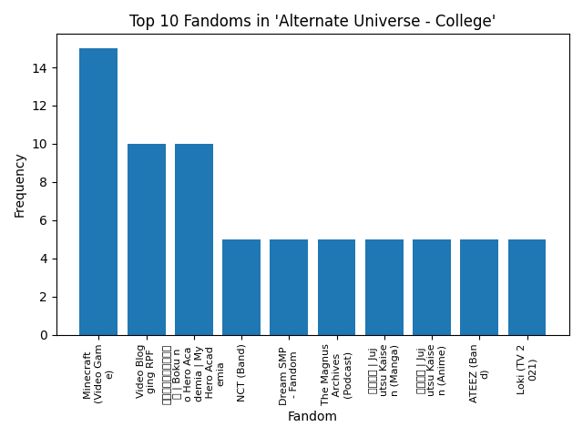

# AO3 Scraper 
Simple web scraper to scrape info on works off Archive Of Our Own. 

## How to use
Run `python3 get-fics.py [number of pages] [fandom/primary tag] [sorting method]`

(For sorting method please use one of the following: 
- authors_to_sort_on
- title_to_sort_on
- created_at
- revised_at
- word_count
- hits
- kudos_count
- comments_count
- bookmarks_count)

Number of pages and sorting method is optional - will default to all search results, and sort by date last updated if not specified.

For fandom/primary tag please use a valid AO3 tag for best results.

Note that there's a 5 second delay for each page that you access to comply with AO3 guidelines.

The results will automatically be saved to `results.csv`

The title, author, fandoms, content rating, relationship type, content warnings, work status, date updated, relationship tags, character tags, freeform tags, summary, language, word count, chapters, comments, kudos, bookmarks and hits will be saved.

For example, run `python3 get-fics.py 3 Glee kudos_count` to get the first 3 pages of fics in the Glee fandom, sorted by kudos.

Run `python3 analyse-fics.py [graph type]` to get a graph of the most popular fandoms/relationships/characters/freeform tags that occur in the primary tag.

(For graph type please use
- fandom
- relationship
- character
- freeform)

This will generate a graph based on the data saved in `results.csv` which can be accessed at `fig.png` or loaded with `index.html`

## To-do
Allow more options in graph generation.

Create an interface so that fan statisticians can easily use this to generate what graphs they'd like.

## Example usage

Run `python3 get-fics.py 5 "Alternate Universe - College" kudos_count`

Run `python3 analyse-fics.py fandom`

This produces the frequency of the top 10 fandoms in "Alternate Universe - College", from the top 100 fics sorted by kudos. 

